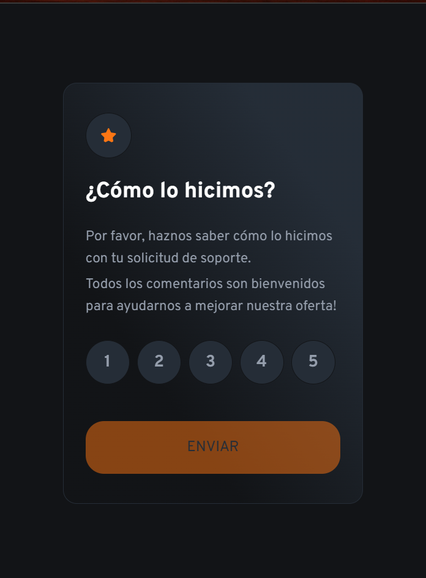
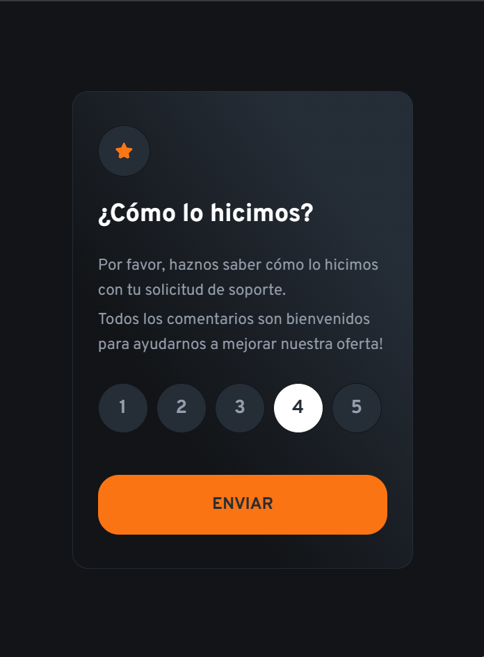
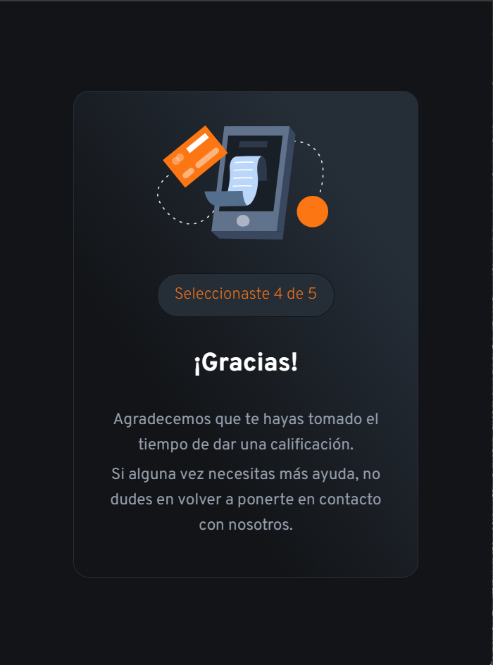

# Módulo 1

## Teórico

<https://forms.gle/zMHrb6vHxUShgutYA>

## Práctico

Vista inicial del componente

Vista cuando el usuario hace hover en una puntuación

Vista cuando el usuario hace click en una puntuación, y retira el ratón

Segunda vista del componente, cuando el usuario hace click en el botón de "Enviar"

## El desafío

Tu desafío es construir este componente de calificación interactivo y lograr que se vea lo más cercano posible al diseño.

Puedes usar cualquier herramienta que desees para completar el desafío:

- HTML, CSS y JavaScript puro (vanilla)
- Componentes funcionales creados por ti con JavaScript vanilla
- Astro

Tus usuarios deberían poder:

- Ver el diseño óptimo de la aplicación sin tener en cuenta el tamaño de la pantalla de su dispositivo (mobile-only)
- Ver estados de hover para todos los elementos interactivos en la página
- Seleccionar y enviar una calificación numérica
- Ver la tarjeta de agradecimiento después de enviar una calificación

## Dónde encontrar todo

Tu tarea es construir el proyecto según los diseños proporcionados como imágenes PNG.
Usar PNGs significará que necesitarás usar tu mejor juicio para estilos como `font-size`, `padding` y `margin`.

Encontrarás todos los recursos necesarios en la carpeta `/images`. Los recursos ya están optimizados.

También hay un archivo `style-guide.md` que contiene la información que necesitarás, como la paleta de colores y las fuentes.

## Construyendo tu proyecto

Siéntete libre de usar cualquier flujo de trabajo con el que te sientas cómodo. A continuación se sugiere un proceso, pero no sientas que necesitas seguir estos pasos:

1. Crea un repositorio git con un `README.md` personalizado
2. Enlaza tu proyecto como un repositorio público en [GitHub](https://github.com/). Será tu forma de entregar el proyecto.
3. Configura tu repositorio para publicar tu código en una dirección web.
4. Revisa los diseños para comenzar a planificar cómo abordarás el proyecto. Este paso es crucial para ayudarte a pensar con anticipación en las clases de CSS para crear estilos reutilizables.
5. Antes de agregar cualquier estilo, estructura tu contenido con HTML. Escribir tu HTML primero puede ayudar a centrar tu atención en crear contenido bien estructurado.
6. Crea las variables de CSS para los colores y fuentes en el archivo `style-guide.md`. Esto te proporcionará un lugar central para almacenar estos valores para que puedas mantenerlos y actualizarlos fácilmente.
7. Escribe los estilos base para tu proyecto, incluyendo estilos generales de contenido, como `font-family` y `font-size`.
8. Comienza a agregar estilos desde la parte superior de la página y trabaja hacia abajo.

Ten en cuenta las limitaciones de tiempo. No es necesario que completes todo el diseño. Si no puedes terminar todo, asegúrate de que tu proyecto esté completo y funcional antes de enviarlo.

## Desplegando tu proyecto

Como se mencionó anteriormente, hay muchas formas de alojar tu proyecto de forma gratuita. Nuestros hosts recomendados son:

- [GitHub Pages](https://pages.github.com/)
- [Vercel](https://vercel.com/)
- [Netlify](https://www.netlify.com/)

Puedes alojar tu sitio utilizando una de estas soluciones o cualquiera de nuestros otros proveedores de confianza.

PUNTOS:

- Repo [] (1)
- Vista 1 HTML [] (1)
- Vista 2 HTML [] (1)
<!-- -------------------------------Repo + HTML [3] -->
- Vista 1 CSS [] (1)
- Vista 2 CSS [] (1)
- Hover en botones de selección [] (1)
<!-- ------------------------------ CSS + Hover [3]-->
- JS - Botones score - Cambio de vista [] (2)
- Ajuste al original [] (0.5)
- Despliegue [] (0.5)
- buen código (si funciona) [] (1)
<!-- ------------------------------ JS + Extras [4]-->
